# Hey there! 😸

I'm someone who believes code should be as elegant as a cat's stretch and as robust as their stubborn refusal to come when called.

## What I'm up to 🎯
- 🎮 Building [game-save-manager](https://github.com/mcthesw/game-save-manager) - because losing 40 hours of gameplay is NOT an option
- 🌐 Crafting network applications and protocols
- 🦀 Wrestling with Rust's borrow checker *(current win rate: 23%)*
- 🐍 Python scripting when I need things to actually work
- ⚡ Vue.js for when I pretend I understand frontend

## Currently learning 📚
C# and Elixir

## Let's chat! 💬
I enjoy communicating with humans (you're welcome too if you're a cat)! Feel free to reach out anytime.

🐱 Click here if you're actually a cat

Meow meow meow, meow meow meow meow! 

---

