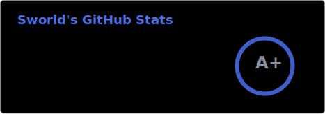
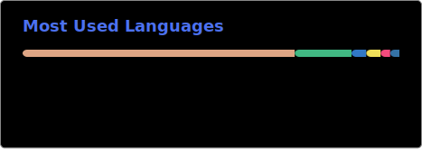

## What I'm up to

- Building [game-save-manager](https://github.com/mcthesw/game-save-manager) and [easy-nats](https://github.com/mcthesw/easy-nats). Always open to collaborators.
- Crafting high-performance network applications, proxy systems, and protocols in Rust.
- Exploring game development on the side.

## Let's collaborate
If you are running short-handed on an interesting project and think it might align with what I do, feel free to reach out. I'd be happy to help out.

## Let's chat
I enjoy communicating with humans (you're welcome too if you're a cat). Drop a line anytime.

---

